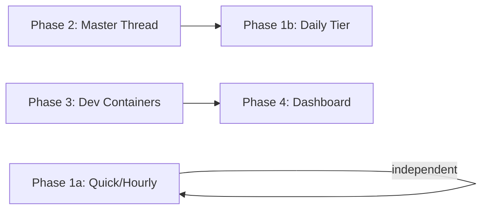

# Team Onboarding, Smart Heartbeat & Dev Infrastructure

## Enhancement Summary

**Deepened on:** 2026-02-11
**Agents used:** security-sentinel, architecture-strategist, performance-oracle, agent-native-reviewer, code-simplicity-reviewer, pattern-recognition-specialist, julik-frontend-races-reviewer, best-practices-researcher, framework-docs-researcher

### Key Design Changes from Research

1. **Simplify heartbeat tier detection.** Keep `processHeartbeat()` as-is (haiku-only). Let the agent self-determine its tier from HEARTBEAT.md timestamps. This preserves the plan's stated principle ("all intelligence lives in the prompt") and eliminates the identified Medium/High YAML parsing risk. Start haiku for all tiers; upgrade to sonnet only if haiku demonstrably fails at daily summaries.

2. **Replace YAML frontmatter with plain markdown timestamps.** Use `- Last quick: <ISO timestamp>` under a `## Timestamps` heading instead of YAML frontmatter. Trivially grep-able by both TypeScript and haiku. Eliminates YAML parsing dependency entirely.

3. **Replace tecnativa/docker-socket-proxy with wollomatic/socket-proxy.** Critical security finding: tecnativa's `POST=1` enables ALL POST operations including `container exec` (arbitrary code execution). wollomatic/socket-proxy uses regex-based URL matching that can allowlist only `POST /containers/{id}/update`.

4. **Split Phase 1 into 1a (quick/hourly) and 1b (daily).** Phase 1a has no dependency on Phase 2 and can ship immediately. Phase 1b (daily summaries to master) depends on Phase 2 being configured.

5. **Add agent-native parity for container management.** Expose container stats and memory adjustment as MCP tools for the master thread. The master thread should be able to act on infrastructure, not just observe.

### Critical Security Findings

- **Docker socket proxy POST=1 enables exec** — must use wollomatic/socket-proxy or custom nginx proxy for path-level control
- **BROKER_SECRET shared across all dev containers** — add per-container audit logging to broker; move org→installation_id lookup server-side
- **Passwordless sudo + unrestricted network** — create separate `dev` network; scope sudo or remove it
- **SSH env vars not inherited by sshd children** — must use `/etc/profile.d/` scripts, not Docker ENV
- **Dashboard has no authentication on mutating POST endpoint** — add bearer token auth

### Performance Guardrails

- **Stagger heartbeat injection** in cron: `sleep $((INTERVAL / THREAD_COUNT))` between writes
- **Cap heartbeat concurrency to 1 slot** — reserve remaining slot(s) for user messages
- **Default dev container memory to 2GB** (not 3GB) — supports 10+ containers on 32GB
- **Dashboard SSE: server-side polling with broadcast** — don't let N clients each make N Docker API calls

### Simplifications Applied

- Removed YAML frontmatter → plain markdown timestamps
- Removed `determineHeartbeatTier()` from TypeScript → agent self-determines
- Removed model selection logic → haiku for all tiers initially
- Removed `timezone` from HEARTBEAT.md → use settings.json as single source
- Removed hourly keyword suppression → trust HEARTBEAT_OK pattern
- Removed 409 conflict handling → last-write-wins for 1-5 admins
- Deferred priority queue ordering → not needed at current scale
- Deferred repository ruleset audit → no current compliance requirement
- Deferred Telegram notification on memory changes → admin already sees the change

---

## Overview

Turn TinyClaw into a team adoption platform with four interconnected capabilities: a tiered heartbeat monitoring system that makes threads proactively aware of their repos, a master thread knowledge base for organizational memory, Docker-based dev containers for onboarding developers to Claude Code, and a live memory rebalancing dashboard.

**Implementation order:** Heartbeat (prompt-only) → Master Thread (config + prompt) → Dev Containers (Docker infra) → Memory Dashboard (UI + Docker API). Each phase is independently deliverable.

## Problem Statement

TinyClaw currently operates as a single-user tool with minimal heartbeat monitoring ("any pending tasks?") and no infrastructure for onboarding additional developers. The heartbeat is a flat haiku one-shot that doesn't leverage git awareness, CI monitoring, or cross-thread coordination. There is no persistent organizational memory beyond individual thread sessions. New developers have no standardized way to access Claude Code in a team context.

## Proposed Solution

Four phased features that build on each other:

1. **Smart Heartbeat** — Enrich `buildHeartbeatPrompt()` and define a HEARTBEAT.md template with tiered cadence (quick/hourly/daily), adding git awareness, CI monitoring, and daily reporting to the master thread. Add model selection logic in `processHeartbeat()` for sonnet-grade daily checks.

2. **Master Thread Knowledge Base** — Give the master thread (threadId: 1) a local-only git repo as its working directory with `context.md`, `decisions.md`, and `active-projects.md`. Enrich the master system prompt to maintain this knowledge base from thread reports.

3. **Dev Container Infrastructure** — Create a purpose-built Dockerfile for developer containers with sshd, Claude Code CLI, git, and credential broker integration. Add a provisioning script and onboarding kit.

4. **Live Memory Rebalancing Dashboard** — New view on the existing dashboard showing per-container memory usage with adjustable limits via `docker update --memory`. Uses Docker socket proxy for security. Sends Telegram notifications on changes.

---

## Phase 1: Smart Heartbeat System

### Architecture

All intelligence lives in the prompt and HEARTBEAT.md — no changes to `heartbeat-cron.sh`. The cron fires at a fixed interval (~8 min), and `processHeartbeat()` determines the tier by reading HEARTBEAT.md timestamps before calling `query()`.

```
heartbeat-cron.sh (unchanged, fires every ~8 min)
  → queue/incoming/{threadId}.json (source: "heartbeat")
  → processHeartbeat() reads HEARTBEAT.md to determine tier
  → selects model: haiku (quick/hourly) or sonnet (daily)
  → buildHeartbeatPrompt() returns tier-appropriate prompt
  → one-shot query() with selected model
  → agent reads HEARTBEAT.md, performs tier actions, updates timestamps
  → HEARTBEAT_OK or findings written to queue/outgoing/
```

### HEARTBEAT.md Template

Each thread's working directory gets a structured HEARTBEAT.md with plain markdown timestamps (not YAML frontmatter — YAML parsing is unreliable for haiku and adds an unnecessary dependency):

```markdown
## Timestamps
- Last quick: 2026-02-11T10:05:00Z
- Last hourly: 2026-02-11T10:00:00Z
- Last daily: 2026-02-11T00:00:00Z

## Urgent Flags
(none)

## Tasks
- [ ] Example task

## Notes
(agent scratch space)
```

The timestamps section is the state store. The agent reads timestamps to know what it last did and updates them after each tier check. Timezone comes from `settings.json` (single source of truth). The format is trivially regex-parseable: `/Last (quick|hourly|daily): (.+)/`.

### Tier Detection: Agent Self-Determines (No TypeScript Changes)

**Design decision (from simplicity review):** Keep `processHeartbeat()` exactly as-is. The agent determines its own tier by reading HEARTBEAT.md timestamps. This preserves the plan's core principle: "all intelligence lives in the prompt."

**No changes to `processHeartbeat()`.** No `determineHeartbeatTier()` function. No `HeartbeatMeta` interface. No model selection branching. The enriched `buildHeartbeatPrompt()` gives the agent all the information it needs to self-determine.

**Model:** Start with haiku for all tiers. If haiku demonstrably fails at daily summaries (can't run `gh api` calls, produces low-quality summaries), upgrade to sonnet later. This is a one-line change when needed (`model: "sonnet"` on line 448), not a tier-detection system.

### Enriched `buildHeartbeatPrompt()`

**File:** `src/session-manager.ts` — `buildHeartbeatPrompt()` at line 203

The prompt becomes tier-aware and time-aware:

**Quick tier prompt additions:**
- Current time and timezone (emphasized, repeated)
- `git status` to check for uncommitted changes
- Check HEARTBEAT.md for urgent flags
- Reply HEARTBEAT_OK if nothing needs attention

**Hourly tier prompt additions (all of quick, plus):**
- `git fetch origin` to detect upstream changes
- `git log HEAD..origin/main --oneline` for new commits
- `gh pr checks` for CI status on open PRs
- Check for merge conflicts with main branch
- Update `last_hourly` timestamp in HEARTBEAT.md frontmatter

**Daily tier prompt additions (all of hourly, plus):**
- Summarize the day's work (from git log and HEARTBEAT.md tasks)
- Send summary to master thread (threadId: 1) via `send_message` MCP tool
- `gh issue list` and `gh pr list` for new/aging items
- Flag stale branches (>7 days without commits)
- Repository ruleset audit: `gh api repos/{owner}/{repo}/rulesets`
- Update `last_daily` timestamp in HEARTBEAT.md frontmatter

**Prompt time handling:** Include the current time and timezone once, clearly. The existing `formatCurrentTime()` at queue-processor.ts:276 already does this. The prompt should say: "The current time is {time} in {timezone}. Read the timestamps from HEARTBEAT.md and compare to determine which checks are due."

### Heartbeat Response Routing

- **Quick:** HEARTBEAT_OK suppressed (existing behavior). Non-OK findings sent to thread's Telegram topic.
- **Hourly:** Same as quick — agent replies HEARTBEAT_OK if nothing notable. Trust the agent to decide what is worth reporting rather than keyword-scanning free-form LLM output.
- **Daily:** Agent sends summary to master thread (threadId: 1) via `send_message` MCP tool, then replies HEARTBEAT_OK to suppress local delivery.

### Heartbeat Stagger and Concurrency (from performance review)

**File:** `heartbeat-cron.sh` — lines 55-73

**Stagger injection:** Instead of writing all N heartbeat files at once (burst), add a sleep between thread iterations:

```bash
# In heartbeat-cron.sh, inside the thread iteration loop
sleep $((INTERVAL / THREAD_COUNT))
```

This converts the burst into a trickle, preventing queue flooding.

**Concurrency cap (future, when >5 threads):** Cap heartbeat processing to 1 concurrent slot in `processQueue()`, reserving remaining slots for user messages:

```typescript
if (msg.source === "heartbeat" && activeHeartbeatCount >= 1) continue;
```

**Skip stale heartbeats (future):** If a heartbeat message has been in the queue longer than 80% of the interval, discard it.

### Files to Change

| File | Change | Scope |
|------|--------|-------|
| `src/session-manager.ts:203-212` | Rewrite `buildHeartbeatPrompt()` with tier-aware instructions | Large (prompt only) |
| `heartbeat-cron.sh:55-73` | Add sleep between thread iterations (stagger) | Small |
| Per-thread `HEARTBEAT.md` | Create template with plain markdown timestamps | Template |

**No changes to:** `processHeartbeat()`, `types.ts`, or `processQueue()`.

### Acceptance Criteria

**Phase 1a (quick + hourly, no dependencies):**
- [ ] Enriched prompt tells agent to read HEARTBEAT.md timestamps and self-determine tier
- [ ] Quick heartbeat: `git status`, check urgent flags, HEARTBEAT_OK if nothing
- [ ] Hourly check: `git fetch`, detect upstream changes, `gh pr checks` for CI status
- [ ] Agent updates timestamps in HEARTBEAT.md after each tier check
- [ ] Heartbeat injection staggered across the interval (not burst)
- [ ] If HEARTBEAT.md doesn't exist, agent creates it from template

**Phase 1b (daily, depends on Phase 2):**
- [ ] Daily check: summarize day's work, send to master thread via `send_message`
- [ ] Agent replies HEARTBEAT_OK after sending daily summary (suppresses local delivery)
- [ ] Thread inventory injected into daily heartbeat prompt so agent knows active threads

---

## Phase 2: Master Thread as Organizational Brain

### Architecture

The master thread (threadId: 1) gets a dedicated local-only git repo as its working directory. This repo stores organizational knowledge that doesn't belong to any specific code repo.

```
/home/clawcian/.openclaw/knowledge-base/
├── context.md          # Who we are, what we're building, team members
├── decisions.md        # Key decisions log (append-only)
├── active-projects.md  # Auto-updated from thread daily reports
└── .git/               # Local-only, never pushed
```

### Setup

1. Create the knowledge-base directory and initialize git repo
2. Seed initial files (context.md with team info, empty decisions.md and active-projects.md)
3. Update master thread's `cwd` in threads.json to point to the knowledge-base directory
4. Enrich master thread system prompt with knowledge-base maintenance instructions

This can be done via:
- A one-time setup script (`scripts/init-knowledge-base.sh`)
- Or manually, then running `/setdir 1 /home/clawcian/.openclaw/knowledge-base`

### Master Thread System Prompt Additions

**File:** `src/session-manager.ts` — master prompt at line 150

Add to the existing master system prompt:

```
## Knowledge Base

Your working directory is a local-only git repo for organizational knowledge.

Files you maintain:
- context.md — Who we are, what we're building, team members
- decisions.md — Append-only log of key decisions (date, decision, rationale)
- active-projects.md — Current status of each repo/thread (updated from daily reports)

When you receive daily summaries from worker threads:
1. Update active-projects.md with the thread's current status
2. If any key decisions were made, append to decisions.md
3. Commit changes: git add -A && git commit -m "Update: <brief description>"

When asked about project status, read active-projects.md first.
```

### Master Heartbeat Extras

The master thread's heartbeat prompt (Phase 1b) gets additional daily-tier instructions:

- Aggregate any unprocessed thread reports in the queue
- Surface anything that needs human attention across all threads

**Removed (from simplicity review):** "Verify knowledge-base structure" and "run git log" — defensive checks that waste haiku tokens. If files are broken, the agent will notice when it tries to read/write them.

### Agent-Native: Knowledge Base Read Access for Workers (from agent-native review)

Worker thread agents can send messages to the master thread but cannot read the knowledge base (`context.md`, `decisions.md`, `active-projects.md`). Add a `query_knowledge_base` MCP tool available to all threads:

```typescript
// In mcp-tools.ts, available to all threads
const queryKnowledgeBase = tool(
    "query_knowledge_base",
    "Read a file from the master thread's knowledge base (context.md, decisions.md, active-projects.md)",
    { filename: z.enum(["context.md", "decisions.md", "active-projects.md"]) },
    async ({ filename }) => {
        const masterConfig = loadThreads()["1"];
        const filePath = path.join(masterConfig.cwd, filename);
        return fs.readFileSync(filePath, "utf-8");
    },
);
```

This lets workers check "what decisions have been made about X?" without an async round-trip to the master thread.

### Thread-to-Master Reporting Flow

```
Worker thread daily heartbeat (sonnet)
  → Agent summarizes day's work
  → Agent calls send_message(targetThreadId=1, message=summary)
  → Message appears in master thread's incoming queue
  → Master thread processes it (next session or heartbeat)
  → Master updates active-projects.md
  → Master commits to local git repo
```

**Key constraint:** Reports are daily and opt-in — only sent if the thread actually did work (the daily heartbeat prompt instructs the agent to check git log for the day; if no commits, skip the report).

### Files to Change

| File | Change | Scope |
|------|--------|-------|
| `src/session-manager.ts:150-174` | Add knowledge-base instructions to master system prompt | Medium (prompt) |
| `src/session-manager.ts:203` | Add master-specific daily heartbeat instructions | Medium (prompt) |
| `scripts/init-knowledge-base.sh` | New script to create and seed the knowledge-base repo | Small |
| `docker-compose.yml` | Add volume mount for knowledge-base directory | Small |

### Acceptance Criteria

- [ ] Master thread cwd points to a local-only git repo
- [ ] Knowledge-base has context.md, decisions.md, active-projects.md
- [ ] Master thread commits changes after updating knowledge files
- [ ] Worker thread daily summaries arrive at master thread
- [ ] Master aggregates reports into active-projects.md
- [ ] `git log` in the knowledge-base shows a history of updates
- [ ] Master heartbeat verifies knowledge-base structure integrity

---

## Phase 3: Dev Container Infrastructure

### Architecture

```
Hetzner Box (32GB RAM)
├── TinyClaw Stack (existing docker-compose)
│   ├── broker (credential broker - GitHub App tokens)
│   ├── bot (TinyClaw Telegram bot + queue processor)
│   └── dashboard
├── Dev Container: alice (SSH on port 2201)
│   ├── Claude Code CLI (pre-installed)
│   ├── git (configured with credential broker)
│   ├── sshd (port 22 → host port 2201)
│   ├── tmux (session persistence)
│   └── ~/repos/ (workspace)
├── Dev Container: bob (SSH on port 2202)
│   └── (same structure)
└── ...
```

### Dev Container Dockerfile

Purpose-built image, NOT extending the bot Dockerfile. The bot image has Claude Agent SDK v2 and queue processing code — the dev container needs Claude Code CLI, sshd, and dev tools.

```dockerfile
# Dockerfile.dev-container
FROM ubuntu:24.04

# System packages
RUN apt-get update && apt-get install -y \
    openssh-server \
    git \
    curl \
    jq \
    tmux \
    vim \
    build-essential \
    sudo \
    && rm -rf /var/lib/apt/lists/*

# Node.js 22
RUN curl -fsSL https://deb.nodesource.com/setup_22.x | bash - \
    && apt-get install -y nodejs

# Claude Code CLI
RUN npm install -g @anthropic-ai/claude-code

# GitHub CLI
RUN curl -fsSL https://cli.github.com/packages/githubcli-archive-keyring.gpg \
    | dd of=/usr/share/keyrings/githubcli-archive-keyring.gpg \
    && echo "deb [arch=$(dpkg --print-architecture) signed-by=/usr/share/keyrings/githubcli-archive-keyring.gpg] https://cli.github.com/packages stable main" \
    > /etc/apt/sources.list.d/github-cli.list \
    && apt-get update && apt-get install -y gh

# SSH configuration (hardened per security review)
RUN mkdir /var/run/sshd \
    && sed -i 's/#PasswordAuthentication yes/PasswordAuthentication no/' /etc/ssh/sshd_config \
    && sed -i 's/#PubkeyAuthentication yes/PubkeyAuthentication yes/' /etc/ssh/sshd_config \
    && sed -i 's/#PermitRootLogin.*/PermitRootLogin no/' /etc/ssh/sshd_config \
    && echo "AllowUsers dev" >> /etc/ssh/sshd_config \
    && echo "MaxAuthTries 3" >> /etc/ssh/sshd_config \
    && echo "LoginGraceTime 30" >> /etc/ssh/sshd_config \
    && echo "AllowAgentForwarding no" >> /etc/ssh/sshd_config \
    && echo "AllowTcpForwarding no" >> /etc/ssh/sshd_config \
    && echo "X11Forwarding no" >> /etc/ssh/sshd_config

# Generate unique host keys at container start (not build time)
RUN rm -f /etc/ssh/ssh_host_*

# Create dev user
RUN useradd -m -s /bin/bash -G sudo dev \
    && echo "dev ALL=(ALL) NOPASSWD:ALL" >> /etc/sudoers.d/dev \
    && mkdir -p /home/dev/.ssh /home/dev/repos \
    && chown -R dev:dev /home/dev

# Git credential helper for GitHub App broker
COPY docker/github-token-helper.sh /usr/local/bin/github-token-helper.sh
COPY docker/gh-wrapper.sh /usr/local/bin/gh-wrapper.sh
RUN chmod +x /usr/local/bin/github-token-helper.sh /usr/local/bin/gh-wrapper.sh \
    && ln -sf /usr/local/bin/gh-wrapper.sh /usr/local/bin/gh-real-path

# Git config (credential broker integration)
RUN git config --system credential.helper '!/usr/local/bin/github-token-helper.sh' \
    && git config --system user.name "Dev" \
    && git config --system user.email "dev@tinyclaw"

# Replace gh binary with wrapper
RUN mv /usr/bin/gh /usr/bin/gh-real \
    && ln -sf /usr/local/bin/gh-wrapper.sh /usr/bin/gh

# CRITICAL: Docker ENV vars are NOT inherited by SSH sessions.
# Must source them from /etc/profile.d/ for login shells.
RUN echo '#!/bin/bash' > /etc/profile.d/broker-env.sh \
    && echo 'export CREDENTIAL_BROKER_URL="${CREDENTIAL_BROKER_URL}"' >> /etc/profile.d/broker-env.sh \
    && echo 'export BROKER_SECRET="${BROKER_SECRET}"' >> /etc/profile.d/broker-env.sh \
    && chmod +x /etc/profile.d/broker-env.sh

# Auto-attach tmux on SSH login (in profile.d, not .bashrc — only runs for login shells)
RUN echo '#!/bin/bash' > /etc/profile.d/tmux-auto.sh \
    && echo 'if [ -n "$SSH_CONNECTION" ] && [ -z "$TMUX" ] && [ -t 0 ]; then' >> /etc/profile.d/tmux-auto.sh \
    && echo '    exec tmux new-session -A -s main' >> /etc/profile.d/tmux-auto.sh \
    && echo 'fi' >> /etc/profile.d/tmux-auto.sh \
    && chmod +x /etc/profile.d/tmux-auto.sh

# Generate host keys on first start + start sshd
EXPOSE 22
CMD ["bash", "-c", "ssh-keygen -A && exec /usr/sbin/sshd -D -e"]
```

### Provisioning Script

```bash
#!/bin/bash
# scripts/create-dev-container.sh
set -euo pipefail

# Usage: ./create-dev-container.sh <name> <port> <ssh-pubkey-file> [memory-limit]
# Example: ./create-dev-container.sh alice 2201 ~/.ssh/alice.pub 2g

log() { echo "[$(date -Is)] $*"; }

if [ $# -lt 3 ]; then
    echo "Usage: $0 <name> <port> <ssh-pubkey-file> [memory-limit]"
    echo "Example: $0 alice 2201 ~/.ssh/alice.pub 2g"
    exit 1
fi

DEV_NAME="$1"
SSH_PORT="$2"
SSH_KEY_FILE="$3"
MEMORY_LIMIT="${4:-2g}"  # Default 2GB (not 3GB — supports 10+ containers on 32GB)

# Discover compose network dynamically (pattern-consistency fix)
NETWORK=$(docker network ls --filter "label=com.docker.compose.project=tinyclaw" \
    --format '{{.Name}}' | grep internal || true)
if [ -z "$NETWORK" ]; then
    log "ERROR: Could not find tinyclaw internal network. Is docker-compose running?"
    exit 1
fi

# Build image if not exists
docker build -t tinyclaw-dev -f Dockerfile.dev-container .

# Create and start container
log "Creating container dev-${DEV_NAME} on port ${SSH_PORT} with ${MEMORY_LIMIT} memory"
docker run -d \
    --name "dev-${DEV_NAME}" \
    --network "${NETWORK}" \
    --hostname "dev-${DEV_NAME}" \
    --label "tinyclaw.type=dev-container" \
    -p "${SSH_PORT}:22" \
    --memory "${MEMORY_LIMIT}" \
    --memory-swap "${MEMORY_LIMIT}" \
    --cpus 2 \
    --cap-drop NET_RAW \
    -e CREDENTIAL_BROKER_URL=http://broker:3000 \
    -e BROKER_SECRET="${BROKER_SECRET}" \
    -v "/secrets/github-installations.json:/secrets/github-installations.json:ro" \
    --restart unless-stopped \
    tinyclaw-dev

# Inject SSH key
docker exec "dev-${DEV_NAME}" bash -c \
    "cat >> /home/dev/.ssh/authorized_keys" < "${SSH_KEY_FILE}"
docker exec "dev-${DEV_NAME}" chown dev:dev /home/dev/.ssh/authorized_keys
docker exec "dev-${DEV_NAME}" chmod 600 /home/dev/.ssh/authorized_keys

log "Container dev-${DEV_NAME} ready on port ${SSH_PORT}"
log "SSH: ssh -p ${SSH_PORT} dev@<host>"
```

**Changes from research:**
- `set -euo pipefail` (pattern consistency with existing scripts)
- Argument validation with usage help (matches `tinyclaw.sh` pattern)
- `log()` function for timestamped output (matches existing convention)
- Dynamic network discovery (not hardcoded)
- `--label tinyclaw.type=dev-container` for dashboard filtering
- `--memory-swap` equals `--memory` (disables swap — clean OOM kills)
- `--cap-drop NET_RAW` (prevents network sniffing from inside container)
- Default 2GB (not 3GB) — supports 10+ containers on 32GB host

### Developer Experience Philosophy

**Two interfaces, no middle ground:**

- **Telegram** — Quick interactions. Ask a question, kick off a task, review a PR, check status. Light touch.
- **Claude Code CLI (via SSH)** — Deep work. Long-running multi-file changes, complex debugging, bypass-permissions mode. Full power.

No IDE. No VS Code. An IDE with Claude Code is a half-measure — you're still in "I write code" mode with an assistant. We want two clean modes: talk to the agent (Telegram) or let the agent loose (CLI). The container exists to give Claude Code a safe, persistent environment with full repo access.

### Session Persistence (Zero-Friction tmux)

The goal: SSH in, you're in tmux. Disconnect, reconnect, you're back where you were. No commands to remember.

**Auto-tmux on SSH connect** (in `/etc/profile.d/tmux-auto.sh` — runs for login shells only, not subshells):
```bash
# Uses `exec` to replace the login shell — when user detaches, SSH closes cleanly
# Uses `-A` flag: attaches if session exists, creates if not
if [ -n "$SSH_CONNECTION" ] && [ -z "$TMUX" ] && [ -t 0 ]; then
    exec tmux new-session -A -s main
fi
```

**Fix the visual glitch on reattach** (in `.tmux.conf`):
```tmux
# Fix display on reattach (resize to new client, then refresh)
set-hook -g client-attached 'resize-window -A'
setw -g aggressive-resize on

# Full mouse support (tmux 3.4 on Ubuntu 24.04)
set -g mouse on

# Right-click context menu (simplified for non-tmux users)
unbind -n MouseDown3Pane
bind -n MouseDown3Pane {
    if -Ft= "#{mouse_any_flag}" {
        select-pane -t=
        send -M
    } {
        display-menu -T "#[align=centre] Actions " -t= -xM -yM \
            "Split Right"      h  "split-window -h -c '#{pane_current_path}'" \
            "Split Below"      v  "split-window -v -c '#{pane_current_path}'" \
            ""                                                                 \
            "Full Screen"      z  "resize-pane -Z"                             \
            "Close Pane"       x  "kill-pane"
    }
}

# Sane defaults
set -g history-limit 50000
set -sg escape-time 10             # No lag after pressing Escape
set -g focus-events on
set -g default-terminal "tmux-256color"
set -ag terminal-overrides ",xterm-256color:RGB"
set -g status-style 'bg=#1a1a2e fg=#e0e0e0'
set -g status-left '#[fg=#00d4ff] dev #[default]| '
set -g status-right '%H:%M'
set -g status-left-length 30
```

**What devs experience:** Right-click anywhere → clean menu with "Split Right", "Split Below", "Close This Pane", "Full Screen". Click a pane to switch to it. Drag borders to resize. Zero tmux knowledge required.

**The developer experience:**
1. `ssh claude-dev` → lands directly in tmux session
2. Run `claude` → start working
3. WiFi drops / close laptop → session persists
4. `ssh claude-dev` → back in the exact same place, same Claude session running
5. No tmux commands needed. Ever.

### Credential Flow (End-to-End)

```
Developer runs: git push origin main
  → git calls credential helper: github-token-helper.sh
  → Helper parses org from the git remote URL
  → Helper looks up installation_id from /secrets/github-installations.json
  → Helper calls: curl http://broker:3000/token?installation_id=$ID
    (with Authorization: Bearer $BROKER_SECRET header)
  → Broker mints GitHub App installation token via @octokit/auth-app
  → Token returned to git credential helper
  → git uses token for HTTPS authentication
  → Push succeeds
```

**Network path:** Dev container → Docker internal network → broker container (port 3000). The broker is already on the `internal` network via docker-compose.yml.

**Important:** The compose-managed network is named `tinyclaw_internal` (project prefix + network name). The provisioning script must use this exact name, not just `internal`.

### Container Lifecycle

| State | Trigger | Behavior |
|-------|---------|----------|
| Created | Admin runs provisioning script | Container running, sshd listening |
| Active | Developer SSH session | Claude Code processes running |
| Idle | No SSH sessions, no active processes | Container uses minimal RAM (~50MB) |
| Stopped | `docker stop dev-alice` or OOM kill | Filesystem preserved, no SSH access |
| Removed | `docker rm dev-alice` | All data lost (unless volumes mounted) |

**Idle container reclamation:** For now, manual. Admin checks dashboard (Phase 4) for idle containers and can stop them to reclaim memory. Future: auto-stop after N days of inactivity.

### Onboarding Kit

Create `docs/onboarding/` with:

**`getting-started.md`** — "Your First 10 Minutes" one-pager:

```markdown
# Getting Started with TinyClaw

## Two Ways to Work

**Telegram** — Quick tasks, questions, kicking things off. Open the Telegram group,
pick a forum topic (each one is a separate Claude session on a specific repo),
and message it. Claude reads the code, does the work, responds.

**Claude Code CLI** — Deep work. SSH into your container, run
`claude --dangerously-skip-permissions` in a repo, and let it loose on complex
multi-file changes, long debugging sessions, or anything that needs
bypass-permissions mode.

Both interfaces talk to the same repos. Use whichever fits the task.

## Telegram Setup

1. Join the Telegram group (link from your admin)
2. Pick a topic and say hi

## CLI Setup

### One-time setup (30 seconds)

Add this to your ~/.ssh/config:

    Host claude-dev
        HostName <hetzner-ip>
        Port 220X
        User dev
        IdentityFile ~/.ssh/<your-key>

### First connection

    ssh claude-dev
    claude login          # One-time: authenticates with your Claude Max plan

### Every time after that

    ssh claude-dev        # You're back where you left off, even after disconnects
    cd repos/<project>
    claude                # Start Claude Code

### If you need a second terminal pane

    Right-click → "Split Right" or "Split Below"
    Click a pane to switch to it
    Drag borders to resize

    This is using tmux, if you want to go deeper and/or customize your ~/.tmuxconf

```

**`ssh-config-snippet.txt`**:
```
Host claude-dev
    HostName <hetzner-ip>
    Port 220X
    User dev
    IdentityFile ~/.ssh/<your-key>
    # Keeps connection alive over flaky WiFi
    ServerAliveInterval 30
    ServerAliveCountMax 5
```

### Files to Create/Change

| File | Change | Scope |
|------|--------|-------|
| `Dockerfile.dev-container` | New: dev container image | Medium |
| `scripts/create-dev-container.sh` | New: provisioning script | Small |
| `scripts/remove-dev-container.sh` | New: teardown script | Small |
| `docs/onboarding/getting-started.md` | New: developer onboarding guide | Small |
| `docs/onboarding/ssh-config-snippet.txt` | New: SSH config template | Tiny |

### Acceptance Criteria

- [ ] `Dockerfile.dev-container` builds successfully with all required packages
- [ ] Provisioning script creates a container with SSH access on the specified port
- [ ] Developer can SSH in, run `claude login`, clone repos, and run `claude`
- [ ] Git operations (clone, push, pull) work via credential broker
- [ ] `gh` CLI works for PR operations
- [ ] tmux auto-attaches on SSH connection (session persistence)
- [ ] Container has memory limit enforced via cgroup
- [ ] Container joins the correct Docker network (tinyclaw_internal)
- [ ] Password auth is disabled; only SSH key auth works
- [ ] Onboarding kit documents the complete flow

---

## Phase 4: Live Memory Rebalancing Dashboard

### Architecture

```
Dashboard Container
  ├── /var/run/docker.sock (via docker-socket-proxy)
  ├── Express API (new endpoints)
  └── Static HTML (new #memory view)

docker-socket-proxy Container (NEW)
  ├── Listens on port 2375 (internal only)
  ├── Proxies to /var/run/docker.sock
  └── Only allows: GET /containers/*, POST /containers/*/update
```

### Docker Socket Security

**Do NOT mount `/var/run/docker.sock` directly into the dashboard.** Use a socket proxy with **path-level URL matching**, not category-level toggles.

**Critical finding (security review):** `tecnativa/docker-socket-proxy` with `POST=1` + `CONTAINERS=1` enables ALL POST operations on container endpoints, including `POST /containers/{id}/exec` (arbitrary code execution inside any container). There is no way to allow only `/containers/{id}/update` while blocking `/containers/{id}/exec`.

**Use `wollomatic/socket-proxy` instead** — it supports regex-based URL matching per HTTP method:

Add to `docker-compose.yml`:

```yaml
docker-proxy:
    image: wollomatic/socket-proxy:1
    command:
        - "-listenip=0.0.0.0"
        - "-allowfrom=0.0.0.0/0"
        - "-allowGET=/v1\\..{1,2}/containers/json"
        - "-allowGET=/v1\\..{1,2}/containers/.+/json"
        - "-allowGET=/v1\\..{1,2}/containers/.+/stats"
        - "-allowPOST=/v1\\..{1,2}/containers/.+/update"
        - "-allowGET=/v1\\..{1,2}/_ping"
    volumes:
        - /var/run/docker.sock:/var/run/docker.sock:ro
    networks:
        - internal
    deploy:
        resources:
            limits:
                memory: 64M
    restart: unless-stopped
    healthcheck:
        test: ["CMD", "wget", "-q", "--spider", "http://localhost:2375/v1.47/_ping"]
        interval: 30s
        timeout: 5s
        retries: 3
```

This allows **only**: list containers, inspect container, get container stats, and update container resources. All other operations (exec, create, delete, start, stop) are blocked at the proxy level.

The dashboard connects to `http://docker-proxy:2375` instead of the socket directly. Add `DOCKER_PROXY_URL=http://docker-proxy:2375` and `depends_on: [docker-proxy]` to the dashboard service.

### New Dashboard API Endpoints

**File:** `src/dashboard.ts`

| Endpoint | Method | Purpose |
|----------|--------|---------|
| `GET /api/containers` | GET | List all containers with memory stats |
| `GET /api/containers/:id/stats` | GET | Live memory stats for a specific container |
| `POST /api/containers/:id/memory` | POST | Update memory limit (body: `{ limit: "4g" }`) |
| `GET /api/host/memory` | GET | Host total RAM and current usage |
| `GET /api/containers/feed` | GET | SSE stream of container memory stats (polls every 5s) |

**Container stats response format:**
```json
{
    "containers": [
        {
            "id": "abc123",
            "name": "dev-alice",
            "status": "running",
            "memory": {
                "usage": 1073741824,
                "limit": 4294967296,
                "usagePercent": 25.0
            },
            "cpus": 2,
            "uptime": "2d 3h",
            "idle": false
        }
    ],
    "host": {
        "totalMemory": 34359738368,
        "availableMemory": 12884901888,
        "allocatedTotal": 21474836480,
        "osReserve": 2147483648
    }
}
```

**Memory update flow:**
```
POST /api/containers/:id/memory { limit: "8g" }
  → Validate: new sum of all limits <= host total - 2GB (OS reserve)
  → Validate: new limit >= 256MB (minimum)
  → Validate: new limit >= current usage * 0.8 (safety margin, warn if close)
  → Call Docker API: POST http://docker-proxy:2375/containers/:id/update
    Body: { "Memory": 8589934592 }
  → If success: send Telegram notification
  → Return updated container stats
```

### Telegram Notification Mechanism

The dashboard calls the Telegram Bot API directly (avoids changing the read-only `.tinyclaw` volume mount):

```typescript
async function notifyMemoryChange(containerName: string, oldLimit: string, newLimit: string): Promise<void> {
    const settings = readSettings();
    const message = `Memory rebalanced: ${containerName} ${oldLimit} → ${newLimit}`;
    const url = `https://api.telegram.org/bot${settings.telegram_bot_token}/sendMessage`;
    await fetch(url, {
        method: 'POST',
        headers: { 'Content-Type': 'application/json' },
        body: JSON.stringify({
            chat_id: settings.telegram_chat_id,
            message_thread_id: 1, // Master thread / general topic
            text: message,
        }),
    });
}
```

This requires the dashboard to have access to `settings.json` (already mounted read-only) which contains the bot token and chat ID.

### Dashboard UI: Memory View

**File:** `static/dashboard.html` — new `#memory` hash route

Following the existing dark-theme vanilla JS pattern:

- **Header bar:** Host total RAM, allocated total, available (color-coded green/yellow/red)
- **Container cards:** One per container, sorted by memory usage descending
  - Container name, status badge (running/stopped)
  - Memory bar: current usage (filled) vs limit (total bar width)
  - Slider: drag to adjust limit (snaps to 64MB increments)
  - Current usage number and limit number displayed
  - "Idle" badge if container has no active processes
- **Footer:** "Apply Changes" button (disabled until slider moved), validation message showing remaining allocatable memory

### Frontend Race Condition Handling (from races review)

The existing dashboard uses `innerHTML` to re-render on every SSE tick. This will **destroy sliders mid-drag**. The `#memory` view must be the first view that does targeted DOM updates:

**1. Per-container interaction state:** Track whether the user is mid-drag on each slider. When SSE fires, skip re-rendering containers the user is actively adjusting. Store server-side values but don't clobber local state.

```javascript
// Per-container: idle / adjusting / applying
const containerStates = new Map();

function onSSEUpdate(containers) {
    for (const c of containers) {
        const state = containerStates.get(c.id);
        if (state && state !== 'idle') {
            // User is mid-interaction — store server value, don't re-render
            state.serverLimit = c.memory.limit;
            continue;
        }
        renderContainerCard(c); // Safe to update DOM
    }
}
```

**2. Apply button state machine:** Disable on click, re-enable on response. Use `finally` for the reset so it works regardless of success/failure.

**3. Event delegation on container wrapper:** Attach slider event handlers to the parent `#memory-cards` div (not individual slider elements), so re-renders of other cards don't destroy handlers.

**4. Server re-reads live stats at POST time:** Never trust client-sent usage values for validation. The server must `GET /containers/{id}/stats` fresh before validating and applying the update.

**5. Batch semantics:** The "Apply Changes" POST sends ALL changed containers in one request. The server validates and applies atomically. This avoids partial applies.

### Validation Rules

1. Sum of all container memory limits must not exceed host total RAM minus 2GB (OS reserve)
2. No container limit below 256MB (Docker minimum is 4MB, but 256MB is practical floor)
3. Warning (non-blocking) if lowering a running container's limit below its current usage — Docker will OOM-kill immediately with no grace period
4. Only allow adjusting containers with `tinyclaw.type=dev-container` label — infrastructure containers (broker, bot, dashboard) should not be adjustable from the UI
5. When raising `Memory`, also raise `MemorySwap` to match (Docker rejects Memory > MemorySwap)
6. Add `express.json()` middleware to the dashboard (first POST endpoint — currently no JSON body parsing configured)

### Files to Create/Change

| File | Change | Scope |
|------|--------|-------|
| `docker-compose.yml` | Add docker-proxy service, add DOCKER_PROXY_URL env to dashboard | Small |
| `src/dashboard.ts` | Add 5 new API endpoints for container management | Medium |
| `static/dashboard.html` | Add #memory view with slider UI | Medium |
| `Dockerfile.dashboard` | No changes needed (dashboard connects to proxy via HTTP) | None |

### Agent-Native: Container Management MCP Tools (from agent-native review)

The master thread should be able to query and manage container resources, not just humans via the dashboard. Add MCP tools for the master thread:

```typescript
// In mcp-tools.ts, master thread only
const getContainerStats = tool(
    "get_container_stats",
    "Get memory usage stats for all running dev containers",
    {},
    async () => {
        const resp = await fetch(`${DOCKER_PROXY_URL}/containers/json`);
        // ... filter by tinyclaw.type=dev-container label, format and return
    },
);

const updateContainerMemory = tool(
    "update_container_memory",
    "Update memory limit for a dev container (e.g., 'dev-alice'). Limit in bytes.",
    { containerName: z.string(), memoryLimitBytes: z.number() },
    async ({ containerName, memoryLimitBytes }) => {
        // ... validate, call Docker proxy API, return result
    },
);
```

This closes the agent-native gap: the master thread can now act on infrastructure issues it discovers in daily reports.

### Acceptance Criteria

- [ ] wollomatic/socket-proxy running, allowlisting only container list/inspect/stats/update
- [ ] Dashboard #memory view shows dev containers (filtered by label) with current usage and limits
- [ ] Sliders adjust memory limits; Apply Changes sends batch POST
- [ ] Validation prevents total allocation from exceeding host RAM minus 2GB
- [ ] `docker update --memory` called on apply, limits change live (no restart)
- [ ] Warning shown when lowering limit below current usage (OOM risk)
- [ ] SSE updates don't destroy sliders mid-drag (per-container interaction state tracking)
- [ ] `express.json()` middleware added for POST endpoints
- [ ] Master thread can query container stats and adjust limits via MCP tools

---

## Open Questions to Resolve During Implementation

### Resolved by This Plan

| Question | Resolution |
|----------|-----------|
| Dev container Dockerfile: extend bot or purpose-built? | Purpose-built (`Dockerfile.dev-container`) |
| How does processHeartbeat() determine the tier? | It doesn't — agent self-determines from HEARTBEAT.md timestamps |
| How does the dashboard send Telegram notifications? | Direct Telegram Bot API call (deferred from MVP) |
| Docker socket security? | `wollomatic/socket-proxy` with regex URL matching (not tecnativa) |
| How do dev containers authenticate with broker? | `BROKER_SECRET` env var via `/etc/profile.d/` (not Docker ENV) |
| YAML frontmatter parsing risk? | Eliminated — use plain markdown timestamps |
| SSH env vars in Docker? | `/etc/profile.d/` scripts sourced by login shells |
| Host key warnings on container rebuild? | `ssh-keygen -A` at container start, not build time |

### Remaining Open Questions

| # | Question | Impact | Default if Unresolved |
|---|----------|--------|-----------------------|
| 1 | Container lifecycle: auto-stop after N days idle? | Nice-to-have | Manual stop via dashboard |
| 2 | Repo checkout: devs manage own clones or pre-populate? | UX | Devs manage own clones |
| 3 | Claude Code version management across containers? | Maintenance | Manual `npm update -g` per container |
| 4 | Adding new GitHub orgs: automate or document? | Ops | Document: edit github-installations.json |
| 5 | 32GB sizing validation: benchmark before committing? | Cost | Start with current box, upgrade when needed |
| 6 | Dev container network isolation from bot/dashboard? | Security | Accept risk initially; add network segmentation later |

---

## Risk Analysis

| Risk | Likelihood | Impact | Mitigation |
|------|-----------|--------|------------|
| Haiku cannot reliably update plain markdown timestamps | Low | Medium | Plain `- Last quick: <timestamp>` format is trivial for haiku; regex-parseable as backup |
| Heartbeat storms starve user messages at 10+ threads | Medium | High | Stagger cron injection; cap heartbeat concurrency to 1 slot |
| Dev container OOM kills lose in-progress work | Medium | Medium | tmux preserves terminal; `--memory-swap=--memory` gives clean kills (no swap thrashing) |
| SSH env vars not available in sessions | High | High | **Fixed:** Use `/etc/profile.d/` scripts, not Docker ENV (critical Claude Code gotcha) |
| BROKER_SECRET exposed to all dev containers | Accepted | Medium | Add audit logging to broker; move org→installation_id lookup server-side (future) |
| Dashboard slider destroyed mid-drag by SSE re-render | High | Medium | Track per-container interaction state; skip re-render while adjusting |
| Docker lowering memory OOM-kills immediately | Medium | High | Server re-reads live stats before applying; warning when limit < current usage |
| Heartbeat cost at scale | Low | Low | ~$0.03/thread/day for haiku (previous estimate of $0.50 was too high) |

---

## Dependencies Between Phases



**Updated dependency graph (from architecture review):**

- **Phase 1a (quick + hourly)** — fully independent, can ship immediately
- **Phase 2 (master thread)** — fully independent, can parallel with 1a
- **Phase 1b (daily tier)** — depends on Phase 2 (master must exist to receive reports)
- **Phase 3 (dev containers)** — fully independent of 1a/1b/2
- **Phase 4 (dashboard memory)** — soft dependency on Phase 3 (useful but can be built/tested against existing containers)

**Parallel development:** Phase 1a + Phase 2 + Phase 3 can all be developed simultaneously.

## References

### Internal References

- Brainstorm: `docs/brainstorms/2026-02-11-onboarding-heartbeat-infra-brainstorm.md`
- Previous Docker plan: `docs/plans/2026-02-10-feat-production-docker-dashboard-broker-plan.md`
- SDK v2 plan: `docs/plans/2026-02-10-feat-agent-sdk-v2-smart-routing-upgrade-plan.md`
- Heartbeat prompt: `src/session-manager.ts:203-212`
- Heartbeat processor: `src/queue-processor.ts:431-466`
- Master thread config: `src/session-manager.ts:62-68`
- Dashboard server: `src/dashboard.ts`
- Dashboard frontend: `static/dashboard.html`
- Docker compose: `docker-compose.yml`
- Credential broker: `broker/index.js`
- Git credential helper: `docker/github-token-helper.sh`
- gh wrapper: `docker/gh-wrapper.sh`

### Institutional Learnings Applied

- Atomic file writes (.tmp + rename) for all new file I/O — `docs/solutions/integration-issues/tinyclaw-v2-evolution-from-fork-to-forum-agent.md`
- Parallel orchestration with Edit tool (not Write) for shared files — `docs/solutions/workflow-patterns/parallel-subagent-orchestration-bulk-todo-resolution.md`
- Session cleanup: always call session.close() in try/finally — same evolution doc
- SDK v2 mcpServers silently ignored; use file queue + system prompt for cross-thread — `docs/solutions/integration-issues/sdk-v2-mcpservers-silent-ignore.md`
- First-run checklist for deployment validation — `docs/solutions/integration-issues/tinyclaw-v2-first-live-run-fixes.md`

### External Research Sources

- [wollomatic/socket-proxy](https://github.com/wollomatic/socket-proxy) — regex-based Docker socket proxy
- [tecnativa/docker-socket-proxy#114](https://github.com/Tecnativa/docker-socket-proxy/issues/114) — POST=1 enables exec (critical security finding)
- [Docker Engine API: POST /containers/{id}/update](https://docs.docker.com/reference/cli/docker/container/update/) — flat JSON body, Memory field in bytes, min 4MB
- [Claude Code Official Devcontainer](https://github.com/anthropics/claude-code/tree/main/.devcontainer) — reference Dockerfile, Node 20 base
- [Claude Code SSH env var issue](https://github.com/anthropics/claude-code/issues/551) — ANTHROPIC_API_KEY not inherited by sshd children
- [Docker cgroup v2 memory.high bug](https://github.com/moby/moby/issues/49599) — MemoryReservation doesn't propagate via docker update
- [tmux display-menu](https://github.com/tmux/tmux/wiki/Advanced-Use) — right-click context menu syntax (tmux 3.2+)
