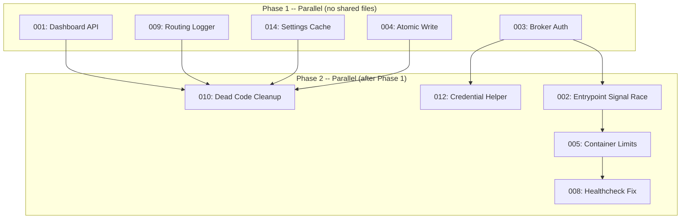

# Parallel Subagent Orchestration for Bulk Code Review Resolution

## Problem Statement

Resolving 10 code review TODOs across a multi-component Telegram agent system (Borg) required a coordinated parallel execution strategy to maximize throughput while avoiding file conflicts. The TODOs spanned P1 critical issues (dashboard API mismatches, signal race conditions, missing authentication, non-atomic writes) and P2 improvements (resource limits, healthchecks, dead code, cache invalidation). The core challenge was orchestrating multiple subagents to edit overlapping files -- particularly `docker-compose.yml`, touched by four separate agents -- without merge conflicts, while respecting inter-TODO dependencies such as the credential helper (012) requiring the broker authentication changes from (003). A two-phase dependency graph with conflict-aware partitioning enabled all 10 TODOs to be resolved in parallel batches, producing 26 changed files with a clean build and zero conflicts.

## Solution

### Two-Phase Parallel Subagent Orchestration

The solution uses a dependency-aware two-phase parallel execution strategy to resolve 10 code review TODOs simultaneously, leveraging the Edit tool's string-matching semantics to avoid merge conflicts on shared files.

**Phase 1 -- Five fully independent agents (zero shared files):**

| Agent | Task | Files Touched |
|-------|------|---------------|
| 001 | Dashboard API | `dashboard.html`, `dashboard.ts` |
| 003 | Broker auth | `broker/index.js`, `docker-compose.yml`, `github-token-helper.sh` |
| 004 | Atomic write | `queue-processor.ts` |
| 009 | Routing logger | `routing-logger.ts` |
| 014 | Settings cache | `session-manager.ts` |

**Phase 2 -- Five agents running after Phase 1 completes (shared files allowed via Edit tool):**

| Agent | Task | Files Touched |
|-------|------|---------------|
| 002 | Entrypoint signal race | `entrypoint.sh`, `docker-compose.yml` |
| 005 | Container resource limits | `docker-compose.yml` |
| 008 | Healthcheck fix | `docker-compose.yml` |
| 010 | Dead code cleanup | `dashboard.ts`, `routing-logger.ts`, `session-manager.ts`, `queue-processor.ts`, `telegram-client.ts`, `package.json` |
| 012 | Credential helper | `github-token-helper.sh` |

**Critical agent instructions for conflict avoidance:**
1. Always use `Edit` (string replacement), never `Write` (full file overwrite), for any file that another agent might touch.
2. Always `Read` the file first to see its current state, since other agents may have already modified it.
3. Skip changes that have already been applied (check file contents before editing) -- handles overlapping concerns like `expandPath` removal appearing in both TODO 009 and TODO 010.
4. Each agent's `old_string` pattern must be unique within the target file so the Edit tool can match unambiguously.

**Results:** 10/10 TODOs resolved, 26 files changed (-311/+801 lines), zero merge conflicts, clean build. Wall-clock time was approximately 2 minutes per phase (~4 minutes total) versus 15+ minutes if run sequentially.

### Dependency Analysis Approach

Steps to build this graph:
1. Build a file-conflict map: which TODOs touch which files
2. Identify explicit dependencies (012 depends on 003)
3. Group Phase 1: items with zero file overlap between them
4. Group Phase 2: items that depend on Phase 1 outputs
5. Within Phase 2, instruct agents to use Edit (not Write) for shared files

## Root Cause Analysis

The core problem was not the 10 TODOs themselves -- it was the naive assumption that parallel code changes to a shared codebase will produce merge conflicts. Three specific root causes drove the need for this orchestration pattern:

1. **File-level conflict model is too coarse.** Traditional merge-conflict thinking operates at the file level: "two agents editing `docker-compose.yml` will conflict." In reality, the Edit tool operates at the string-match level. Four agents successfully edited `docker-compose.yml` in parallel because each targeted a different, non-overlapping YAML block (env vars, init/stop_grace_period, deploy.resources, healthcheck commands). The conflict unit is the unique string pattern, not the file.

2. **Implicit dependencies between TODOs were not surfaced by the review.** TODO 012 (credential helper) depended on TODO 003 (broker auth) because 003 created the Authorization header that 012 then modified around. TODO 010 (dead code cleanup) overlapped with TODO 009 (routing logger) because both removed the same `expandPath` utility. Without building an explicit file-conflict map and dependency graph before execution, parallel runs would have produced race conditions or redundant edits.

3. **Write tool is fundamentally incompatible with parallel editing.** The `Write` tool replaces the entire file contents, meaning the last agent to write wins and all other agents' changes are silently lost. The `Edit` tool's find-and-replace semantics are inherently composable -- multiple non-overlapping edits to the same file commute regardless of execution order. This is the key architectural insight: Edit-based modifications are order-independent as long as the target strings do not overlap.

## Prevention

The 10 TODOs share a common origin: rapid architectural pivots (WhatsApp to Discord to Telegram, SDK v2 to v1, bare-metal to Docker) that outpaced review and enforcement mechanisms.

### 1. Automated Code Review Pipeline

**Prevents:** API mismatches (001), pattern violations (004, 009), dead code (010), missing error handling (012).

- Run specialized review agents (architecture-strategist, security-sentinel, pattern-recognition-specialist, code-simplicity-reviewer, performance-oracle) after every significant feature branch.
- Gate merges to `main` on a review agent pass.
- Version agent prompts in the repository so they evolve with the architecture.

### 2. Reusable Parallel Resolution Workflow

**Prevents:** Merge conflicts and regressions when resolving batches of code fixes.

- Analyze pending fixes for file-level conflicts before starting.
- Group non-conflicting fixes into parallel work streams.
- Identify sequential dependencies.
- Document the conflict matrix before starting work, not after discovering conflicts.

### 3. Pattern Enforcement via Linting

**Prevents:** Non-atomic file writes (004), sync/async pattern violations (009).

- Custom ESLint rule or pre-commit hook flagging `writeFileSync` without the `.tmp` + `renameSync` pattern.
- Enforce `nodenext` import conventions via TypeScript compiler strictness.

### 4. Docker/Compose Linting

**Prevents:** Missing signal handling (002), absent resource limits (005), broken healthchecks (008), missing authentication (003).

- Integrate `hadolint` for Dockerfiles and compose linter for Compose files.
- Maintain a project-specific checklist: init process, resource limits, healthchecks, auth on exposed ports.
- Run `docker compose config` in CI to validate YAML.

### 5. Dead Code Detection

**Prevents:** Stale exports, unused functions, orphaned modules (010).

- Enable `noUnusedLocals` and `noUnusedParameters` in CI tsconfig.
- Periodically run `ts-prune` to detect exported symbols with zero import sites.
- After any major migration, do an explicit dead code sweep.

### 6. Integration Testing for API Contracts

**Prevents:** Dashboard API mismatches (001), healthcheck failures (008), stale cache responses (014).

- Minimal integration test hitting every HTTP endpoint and asserting on response shape.
- Run on every PR touching `src/` or `docker-compose*.yml`.

## Best Practices

1. **Atomic writes are non-negotiable.** Any file read by another process must use `.tmp` + `renameSync`. Partial writes to `threads.json` can corrupt session state for every active thread.

2. **Signals propagate or processes leak.** Every container spawning Node.js processes must ensure SIGTERM reaches them. Use `init: true` in Compose or `tini` in the Dockerfile.

3. **Resource limits are set at deployment time, not "later."** A container without `mem_limit` can OOM the host. Set conservative limits and tune upward.

4. **Every exposed port is a security surface.** Default to `127.0.0.1` binding and require explicit opt-in to public exposure.

5. **Build artifacts are the source of truth for dead code.** Treat compiler warnings as errors in CI.

6. **API contracts should be tested, not assumed.** A single integration test asserting on response shape prevents silent dashboard breakage.

7. **Review after every architectural pivot.** After completing any major migration, schedule a dedicated review pass focused on artifacts of the old architecture.

## Related Documentation

- `docs/solutions/integration-issues/borg-v2-evolution-from-fork-to-forum-agent.md` -- Architecture evolution and cross-thread orchestration
- `docs/solutions/integration-issues/sdk-v2-mcpservers-silent-ignore.md` -- SDK v1 vs v2 MCP support
- `docs/solutions/integration-issues/borg-v2-first-live-run-fixes.md` -- First deployment fixes
- `docs/plans/2026-02-10-feat-production-docker-dashboard-broker-plan.md` -- Plan that generated these TODOs
- `docs/plans/2026-02-10-feat-agent-sdk-v2-smart-routing-upgrade-plan.md` -- Routing and session architecture
